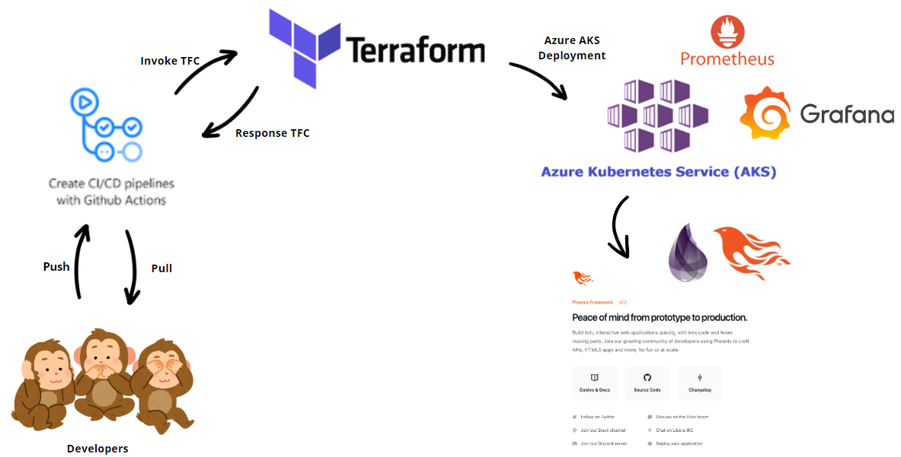

# 🐒 Junior-DevOps-Engineer-Challenge -🐒

Mono es una plataforma tecnológica que permite a las empresas lanzar productos fintech y mover dinero fácilmente a través de Latam. A medida que Mono continúa creciendo, estamos en la búsqueda de los mejores y más brillantes talentos, como Marcela Sabogal, para construir el futuro de la banca empresarial.

## Descripción del Desafío 🐒
 Para este desafío se creó un pipeline de CI/CD que permite desplegar un clúster de Kubernetes en Azure, utilizando una herramienta de Infrastructure as Code (IaC) como Terraform. Se utilizó Grafana y Prometheus para la monitorización de la aplicación, y se implementó el envío de notificaciones por correo electrónico mediante Terraform. Este pipeline también incluye el despliegue de una aplicación de ejemplo desarrollada con Elixir y Phoenix. 
El proceso se descompuso en pasos específicos, donde se explican las decisiones técnicas consideradas, la implementación realizada y cómo se ejecutó cada fase. La relación entre las herramientas utilizadas en este proyecto se presenta en la siguiente imagen.

| Paso                                               | Descripción                                                                                                                                                                                                                                                                                   |
|----------------------------------------------------|------------------------------------------------------------------------------------------------------------------------------------------------------------------------------------------------------------------------------------------------------------------------------------------------|
| [1. Pipeline de CI/CD:](README1.md)                | Configuración de un pipeline en GitHub Actions que se ejecuta automáticamente al hacer `push` a la rama principal del repositorio. Este pipeline asegura la integración continua, permitiendo la verificación automática del código y la ejecución de pruebas para mantener la calidad del proyecto.           |
| [2. Despliegue de Kubernetes:](README2.md)         | Creación de un clúster de Kubernetes en Azure utilizando Terraform como herramienta de infraestructura como código (IaC). Este enfoque permite definir y aprovisionar el clúster de manera eficiente y reproducible, facilitando la gestión de la infraestructura en la nube.                           |
| [3. Despliegue de la aplicación:](README3.md)      | Selección de una aplicación de ejemplo desarrollada en Elixir utilizando el framework Phoenix. Se creó una imagen dockerizada de la aplicación y se generaron los archivos de configuración necesarios para desplegarla en Kubernetes, incluyendo los servicios dependientes.                     |
| [4. Monitoreo/Notificación del despliegue de la aplicación:](README4.md) | Implementación de un sistema de monitoreo y notificación para el despliegue de la aplicación. Al finalizar el despliegue, se genera una notificación por correo electrónico utilizando Terraform. Además, la aplicación desplegada está configurada para exportar métricas, que son recolectadas y visualizadas mediante Grafana y Prometheus, asegurando un monitoreo efectivo del rendimiento y la disponibilidad de la aplicación. |

El abodaje de esta propuesta fue realizado por: [**Marcela Sabogal**](https://www.linkedin.com/in/marcelasabogue/) 🐵🙊🙉🙈