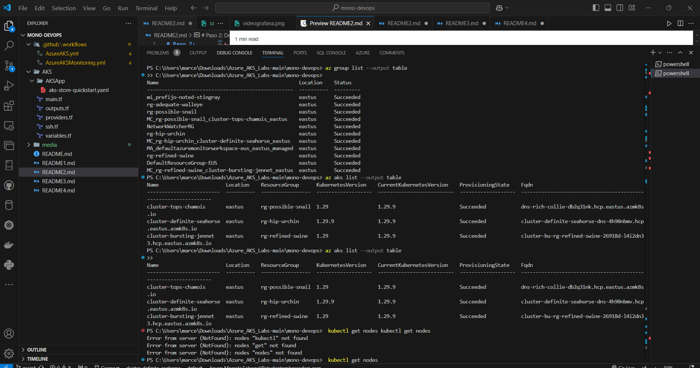

# Paso 2: Despliegue de Kubernetes 🐵🙊🙉🙈

Para la implementación de clústeres de Kubernetes en Azure, empleé Terraform creando varios scripts que incluyen la definición de un grupo de recursos con un nombre único generado aleatoriamente, la configuración del clúster de Kubernetes con un grupo de nodos y credenciales de administrador, y la parametrización mediante variables para facilitar ajustes en la configuración. Además, incluí salidas que exponen información clave como certificados y credenciales, y generé un par de claves SSH para la autenticación segura. La configuración de proveedores y el uso de un backend remoto para el estado de Terraform garantizan una gestión eficiente y reproducible de la infraestructura como código.

A continuación, definiré el contenido y la funcionalidad de cada script involucrado en la implementación. Cada uno de estos scripts desempeña un papel crucial en la creación y gestión de la infraestructura, asegurando que todos los componentes estén correctamente configurados y sean interoperables. Desglosaré los scripts de Terraform utilizados para definir los recursos, manejar las credenciales y facilitar la implementación del clúster de Kubernetes en Azure.

### - `main.tf`

Automatización para la creación y configuración de un entorno de Kubernetes en Azure, asegurando que todos los recursos se configuren de manera adecuada y eficiente.

1. **Generación de nombres aleatorios**: Utiliza el recurso `random_pet` para generar un sufijo aleatorio que se usará en el nombre del grupo de recursos y en el nombre del clúster de Kubernetes.

2. **Creación del grupo de recursos**: Se crea un grupo de recursos en la ubicación especificada, con un nombre que incluye el sufijo aleatorio generado.

3. **Configuración del clúster de Kubernetes**: Se define un clúster de Kubernetes que:
   - Usa la misma ubicación que el grupo de recursos.
   - Tiene un nombre y un prefijo DNS aleatorio.
   - Se le asigna una identidad gestionada del sistema para facilitar la interacción segura con otros recursos de Azure.

4. **Configuración del grupo de nodos**: Se especifica un grupo de nodos con un tamaño de máquina virtual y una cantidad de nodos definidos por variables.

5. **Perfil de usuario**: Se establece un perfil de Linux que incluye un nombre de usuario y una clave SSH para acceder al clúster.

6. **Configuración de la red**: Se define el perfil de red del clúster, especificando el complemento de red y el tipo de SKU del balanceador de carga.

### - `outputs.tf`

Este script se encarga de exponer información crítica sobre los recursos de Azure y la configuración del clúster de Kubernetes, asegurando que datos sensibles estén adecuadamente protegidos.

1. **Nombre del grupo de recursos**: 
   - `resource_group_name`: Devuelve el nombre del grupo de recursos creado.

2. **Nombre del clúster de Kubernetes**: 
   - `kubernetes_cluster_name`: Proporciona el nombre del clúster de Kubernetes creado.

3. **Certificados y claves**: 
   - `client_certificate`: Devuelve el certificado del cliente para autenticación, marcado como sensible para proteger la información.
   - `client_key`: Proporciona la clave del cliente, también sensible.
   - `cluster_ca_certificate`: Devuelve el certificado de la autoridad certificadora del clúster, sensible.
   - `cluster_password`: Proporciona la contraseña del clúster, marcada como sensible.
   - `cluster_username`: Devuelve el nombre de usuario para acceder al clúster, sensible.
   - `host`: Proporciona la dirección del host del clúster, también sensible.

4. **Configuración de Kubernetes**:
   - `kube_config`: Devuelve la configuración completa de Kubernetes (kubeconfig) en un formato crudo, marcado como sensible.

### - `providers.tf`

 Este script establece el entorno de Terraform para interactuar con Azure, define las versiones requeridas de los proveedores, y configura el almacenamiento remoto del estado en Terraform Cloud.

1. **Versión de Terraform**:
   - Se establece que se requiere una versión de Terraform mayor o igual a 1.0.
  
2. **Proveedores requeridos**:
   - **azapi**: Proveedor para recursos de Azure API, con una versión de aproximadamente 1.5.
   - **azurerm**: Proveedor para recursos de Azure Resource Manager, con una versión de aproximadamente 3.0.
   - **random**: Proveedor para generar recursos aleatorios, con una versión de aproximadamente 3.0.
   - **time**: Proveedor para gestionar recursos relacionados con el tiempo, con una versión específica de 0.9.1.

3. **Backend remoto**:
   - Se configura el backend remoto en Terraform Cloud (`app.terraform.io`), perteneciente a la organización "Marcela".
   - Se especifica el workspace llamado "mono_devops" para almacenar el estado de la infraestructura.

4. **Proveedor de Azure**:
   - Se declara el proveedor `azurerm` y se inicializa con las características predeterminadas.

### - `ssh.tf`

Este script configura la generación y almacenamiento de un par de claves SSH en Azure, facilitando su uso para conexiones seguras a recursos en la nube.

1. **Generación de un nombre aleatorio**:
   - Se utiliza el recurso `random_pet` para crear un nombre único para la clave SSH, con el prefijo "ssh" y sin un separador.

2. **Acción para generar el par de claves SSH**:
   - El recurso `azapi_resource_action` ejecuta una acción para generar un par de claves SSH en Azure, especificando el tipo de recurso (`Microsoft.Compute/sshPublicKeys@2022-11-01`).
   - El `resource_id` se refiere al ID del recurso donde se almacenará la clave SSH.
   - La acción se realiza mediante el método `POST`, y se exportan los valores de salida de la clave pública y privada.

3. **Creación del recurso de clave SSH**:
   - Se declara el recurso `azapi_resource` para crear la clave SSH pública en Azure, utilizando el nombre generado aleatoriamente y el grupo de recursos definido anteriormente.

4. **Salida del script**:
   - Se define una salida llamada `key_data`, que exporta el valor de la clave pública generada por la acción anterior.

### - `variables.tf`

Este script de Terraform define varias variables que se utilizan para configurar recursos en Azure. Estas variables permiten parametrizar la configuración de recursos en Azure, facilitando la reutilización y personalización del script según las necesidades específicas del usuario.
A continuación se describe cada variable:

1. **`resource_group_location`**:
   - **Tipo**: `string`
   - **Valor por defecto**: `"eastus"`
   - **Descripción**: Especifica la ubicación geográfica donde se creará el grupo de recursos.

2. **`resource_group_name_prefix`**:
   - **Tipo**: `string`
   - **Valor por defecto**: `"rg"`
   - **Descripción**: Prefijo del nombre del grupo de recursos que se combina con un ID aleatorio para garantizar que el nombre sea único en la suscripción de Azure.

3. **`node_count`**:
   - **Tipo**: `number`
   - **Valor por defecto**: `2`
   - **Descripción**: Cantidad inicial de nodos para el grupo de nodos en el clúster de Kubernetes.

4. **`msi_id`**:
   - **Tipo**: `string`
   - **Valor por defecto**: `null`
   - **Descripción**: ID de la Identidad de Servicio Administrado (Managed Service Identity). Se debe establecer este valor si se está ejecutando el ejemplo utilizando la identidad administrada como método de autenticación.

5. **`username`**:
   - **Tipo**: `string`
   - **Valor por defecto**: `"azureadmin"`
   - **Descripción**: Nombre de usuario del administrador para el nuevo clúster.

