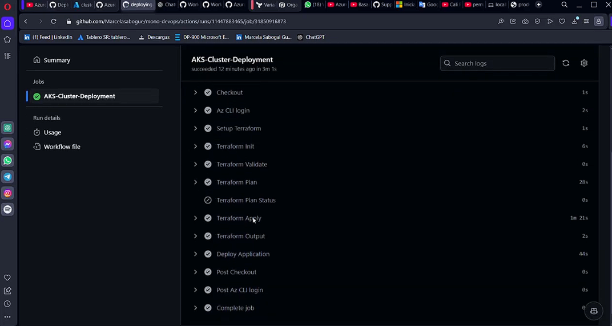

# Paso 3: Despliegue de la aplicación 🐵🙊🙉🙈

Selección de una aplicación de ejemplo desarrollada en Elixir utilizando el framework Phoenix. Se creó una imagen dockerizada de la aplicación y se generaron los archivos de configuración necesarios para desplegarla en Kubernetes, incluyendo los servicios dependientes. Se aseguró que la aplicación fuera accesible después del despliegue, garantizando una correcta exposición y funcionamiento en el entorno de Kubernetes.       

*(Haz clic en la imagen de arriba para ver un video ilustrativo del proceso)*

> **Nota:**Lastimosamente al momento del desplieque la imagen que dockerize de la aplicacion en Elixir que realicé presento algunos problemas de versionado y por temas de tiempo decidí desplega otra imagen de otra aplicación (`aks-store-quickstart.yaml`). Sin embargo hablare un poco del proceso de creación de ambas.

# Aplicación de Elixir 

Para tener la aplicación Phoenix lista, primero instalé Elixir (versión 1.7) y Erlang siguiendo las instrucciones de la página de instalación de Elixir [Phoenix documentación](https://hexdocs.pm/phoenix/installation.html). Luego, instalé Hex, el gestor de paquetes de Elixir, ejecutando `mix local.hex`. A continuación, instalé el generador de aplicaciones de Phoenix con `mix archive.install hex phx_new`. Opté por PostgreSQL como base de datos, siguiendo las guías de instalación correspondientes. Con todo esto listo, creé mi primera aplicación usando `mix phx.new mono_app`, y finalmente, entré en el directorio de la aplicación y ejecuté el servidor con mix phx.server, lo que me permitió acceder a la aplicación en el navegador y comenzar a desarrollarla.

([Repositorio de la aplicación creada en Elixir](https://github.com/Marcelasabogue/AplicacionElixir))

Se buscó dockerizar la aplicación realizada empleando los siguientes archivos:
 - **.devcontainer**: Configura el entorno de desarrollo.
- **Dockerfile**: Construye una imagen de contenedor personalizada.
- **devcontainer.json**: Configura el entorno de desarrollo en contenedor para herramientas como VS Code.
- **docker-compose.yml**: Define y gestiona aplicaciones de múltiples contenedores.A continuación, se detalla la función de cada uno:

## 1. **.devcontainer**

- Este directorio contiene la configuración necesaria para un entorno de desarrollo en contenedor.

## 2. **Dockerfile**

- *Este `Dockerfile` crea una imagen de Docker para aplicaciones Elixir y Phoenix, utilizando la imagen base de Elixir 1.13.1. Instala Node.js, Phoenix y sus dependencias, y configura un directorio de aplicación. Se establece un usuario no root para mayor seguridad y se expone el puerto 4000, que es el puerto por defecto de Phoenix. También incluye configuraciones para instalar Yarn y permite el uso de sudo sin contraseña, si es necesario.

## 3. **devcontainer.json**
Este archivo de configuración devcontainer.json define un entorno de desarrollo para una aplicación Phoenix utilizando Docker. Establece el nombre del entorno como "Docker Phoenix" y especifica que se usará el archivo docker-compose.yml para gestionar los servicios. El servicio principal se llama "app" y se establece la carpeta de trabajo en /app. Se reenvía el puerto 4000 para el acceso externo, y al cerrar el entorno, se detienen los servicios de Docker. Además, incluye extensiones de Visual Studio Code relevantes para Elixir, Phoenix y Svelte. Finalmente, configura una variable de entorno para habilitar el historial en la consola de Erlang.
## 4. **docker-compose.yml**
Este archivo docker-compose.yml define un entorno de múltiples contenedores para una aplicación Phoenix y una base de datos PostgreSQL. En la sección de servicios, se especifica:

1. app:

- Construye la imagen utilizando el Dockerfile ubicado en .devcontainer.
- Ejecuta el comando sleep infinity para mantener el contenedor en ejecución.
- Establece las variables de entorno para el puerto y la vinculación.
- Reenvía el puerto 4000, permitiendo el acceso a la aplicación desde fuera del contenedor.
- Monta el directorio del proyecto en /app dentro del contenedor y también integra la configuración de Git del usuario para evitar reconfiguraciones.
- Depende del servicio de base de datos db.
2. db:

Usa la imagen de PostgreSQL 12 y configura las credenciales de acceso.
Expone el puerto 5432 y almacena los datos en un volumen persistente llamado database.
Al final, se define un volumen llamado database para asegurar la persistencia de los datos de la base de datos.

# Aplicación implementada RabbitMQ - Aplicación de Microservicios en Kubernetes

### Propósito
RabbitMQ actúa como un sistema de mensajería que permite la comunicación entre los servicios de forma asíncrona. Esto es crucial para desacoplar los servicios, facilitando su escalabilidad y mantenimiento.

### Implementación
- **Deployment**: Se define un `Deployment` que asegura que siempre haya una instancia de RabbitMQ en ejecución.
  - **Réplicas**: Se establece en 1 para simplificar la implementación.
  - **Contenedor**: Usa la imagen de RabbitMQ con herramientas de gestión.
  - **Puertos**:
    - `5672`: Para el protocolo AMQP.
    - `15672`: Para la interfaz de gestión HTTP.
  - **Configuraciones**: Se establecen variables de entorno para el usuario y la contraseña predeterminados.
  - **ConfigMap**: Permite habilitar plugins como el de gestión y prometheus.

### Servicio
- **Tipo**: `ClusterIP`, lo que permite que otros servicios se conecten internamente sin exponer el puerto al exterior.

## 2. Order Service

### Propósito
Este servicio maneja las operaciones relacionadas con los pedidos. Se comunica con RabbitMQ para enviar y recibir mensajes sobre los pedidos de los clientes.

### Implementación
- **Deployment**: Se crea un `Deployment` para el servicio de pedidos.
  - **Contenedor**: Usa una imagen específica que gestiona los pedidos.
  - **Puertos**: Expone el puerto `3000`.
  - **Variables de entorno**: Configuran la conexión a RabbitMQ y otros parámetros relevantes.
  - **Init Container**: Asegura que el servicio de pedidos se inicie solo cuando RabbitMQ esté disponible.

### Servicio
- **Tipo**: `ClusterIP`, expone el puerto `3000` para el acceso interno.

## 3. Product Service

### Propósito
Gestiona la información de productos, permitiendo a otros servicios y al frontend consultar detalles de productos.

### Implementación
- **Deployment**: Se define un `Deployment` para el servicio de productos.
  - **Contenedor**: Utiliza una imagen diseñada para gestionar productos.
  - **Puertos**: Expone el puerto `3002`.

### Servicio
- **Tipo**: `ClusterIP`, expone el puerto `3002` para el acceso interno.

## 4. Store Front

### Propósito
El servicio frontend proporciona la interfaz de usuario para interactuar con el sistema de pedidos y productos.

### Implementación
- **Deployment**: Se define un `Deployment` para el frontend.
  - **Contenedor**: Utiliza una imagen que sirve la aplicación frontend.
  - **Puertos**: Expone el puerto `8080`.
  - **Variables de entorno**: Configuran las URLs para conectarse a los servicios de pedidos y productos.

### Servicio
- **Tipo**: `LoadBalancer`, que expone el puerto `80` al exterior, permitiendo a los usuarios acceder a la aplicación desde Internet.

## Flujo de Trabajo

1. **Inicio de RabbitMQ**: Cuando se despliega la aplicación, RabbitMQ se inicia primero, garantizando que otros servicios puedan conectarse a él.
2. **Inicio de Order Service**: Después de que RabbitMQ esté operativo, el servicio de pedidos se inicia, permitiendo la gestión de órdenes.
3. **Inicio de Product Service**: Este servicio puede operar independientemente, pero interactúa con RabbitMQ según sea necesario.
4. **Inicio de Store Front**: Finalmente, el frontend se despliega y se conecta a los servicios de pedidos y productos, ofreciendo una interfaz para los usuarios.

