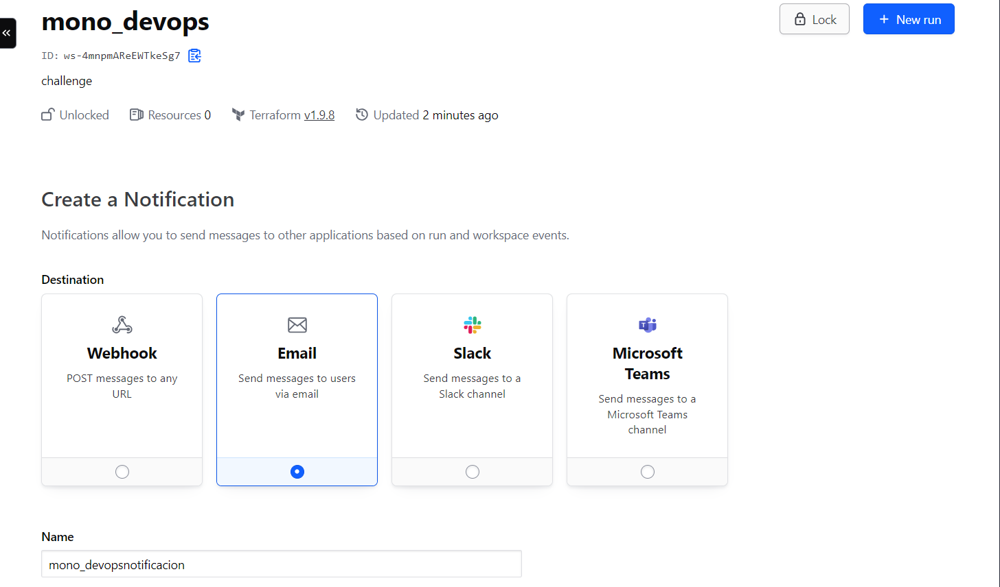
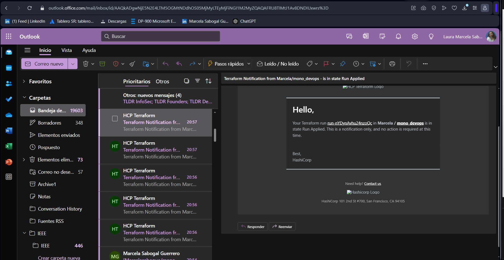

# Paso 3: Despliegue de la aplicación 🐵🙊🙉🙈

Implementación de un sistema de monitoreo y notificación para el despliegue de la aplicación. Al finalizar el despliegue, se genera una notificación por correo electrónico utilizando Terraform. Además, la aplicación desplegada está configurada para exportar métricas, mediante Grafana y Prometheus, asegurando un monitoreo efectivo del rendimiento y la disponibilidad de la aplicación. 


[](https://youtu.be/rYGsFI3o6AY)

*(Haz clic en la imagen de arriba para ver un video ilustrativo del proceso)*

Para acceder al monitoreo de AKS, sigue estos pasos:

```bash
# 1. Inicia sesión en Azure
az login --use-device-code

# 2. Obtener las credenciales de tu clúster AKS
az aks get-credentials --resource-group "<rg>" --name "<nombre del clúster>"

# 3. Verificar los pods en el namespace de monitoreo
kubectl --namespace monitoring get pods -l "release=prometheus"

# 4. Redirigir el puerto para acceder a Prometheus
kubectl port-forward --namespace monitoring svc/prometheus-kube-prometheus-prometheus 9090

# 5. Redirigir el puerto para acceder a Grafana
kubectl port-forward --namespace monitoring svc/prometheus-grafana 8080:80

# 6. Credenciales de Grafana
# - Nombre de usuario: admin
# - Contraseña: password
```
# Notificaciones Terraform
Se configuraron notificaciones por correo electrónico para alertar sobre eventos en el proceso de ejecución de Terraform en los siguientes estados: "Creado", "Planificación", "Necesita Atención", "Aplicando", "Completado" y "Error".




