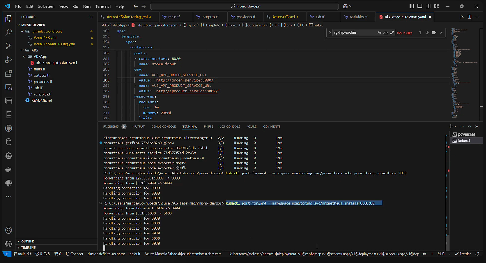

# Step 4. Implementation of a Monitoring and Notification System for Application Deployment
 🐵🙊🙉🙈
# 
A monitoring and notification system was implemented for the application deployment. Upon completion of the deployment, an email notification is generated using Terraform. Additionally, the deployed application is configured to export metrics through Grafana and Prometheus, ensuring effective monitoring of the application's performance and availability.

[](https://youtu.be/rYGsFI3o6AY)

*(Click the image above to view an illustrative video of the process)*

To access monitoring for AKS, follow these steps:

```bash
# 1. Log in to Azure
az login --use-device-code

# 2. Obtain credentials for your AKS cluster
az aks get-credentials --resource-group "<rg>" --name "<cluster name>"

# 3. Verify the pods in the monitoring namespace
kubectl --namespace monitoring get pods -l "release=prometheus"

# 4. Forward the port to access Prometheus
kubectl port-forward --namespace monitoring svc/prometheus-kube-prometheus-prometheus 9090

# 5. Forward the port to access Grafana
kubectl port-forward --namespace monitoring svc/prometheus-grafana 8080:80

# 6. Grafana Credentials
# - Username: admin
# - Password: password

```
# Terraform Notifications
Email notifications were configured to alert about events in the Terraform execution process in the following states: "Created," "Planning," "Needs Attention," "Applying," "Completed," and "Error."


